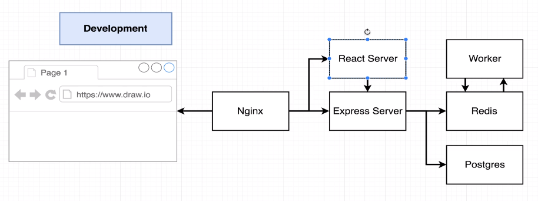
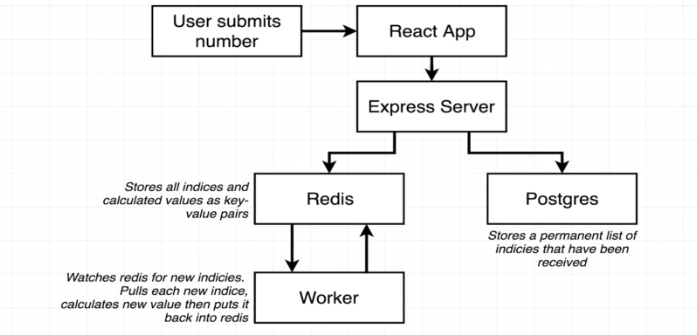

# Fibonacci Mirco-Services

This is a multi-container Dockerized application built for learning purposes. It calculates Fibonacci sequences while emphasizing the multi-container aspect of Docker. Even though the application is designed to be complex with multiple containers, the functionality of the Fibonacci calculator is kept simple for easy understanding and learning.

## Application Architecture

The application is divided into the following parts:

1. **NGINX:** Acts as a reverse proxy to route requests to either the React server (for frontend) or the Express server (for backend/API requests).
2. **Client Container (React):** The frontend of the application, built with React. It provides the user interface for the Fibonacci calculator.
3. **Server Container (Express):** The backend of the application, built with Express. It handles API requests and contains the logic for the Fibonacci calculator.
4. **Redis:** An in-memory data structure store, used as a database and message broker.
5. **Postgres:** A powerful, open-source object-relational database system with strong reputation for reliability, data integrity, and correctness.
6. **Worker:** A worker process that handles tasks from Redis.

Below is the architecture diagram for the application:




## Running the Application

To run the application, use the following commands:

```sh
# Build the Docker images
docker-compose build

# Start the Docker containers
docker-compose up
```

The application will now be accessible at localhost:8080.

## License

